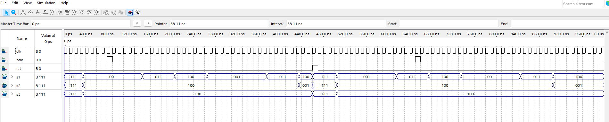
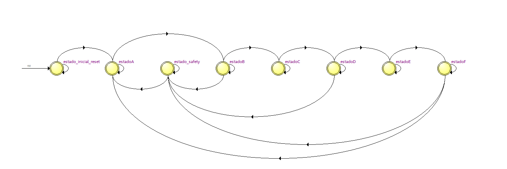
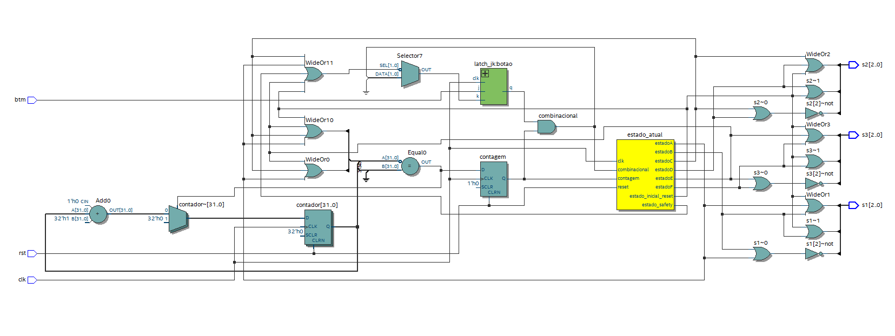

# Semáforo Controlado com FSM em VHDL

Este projeto implementa um sistema de semáforo utilizando VHDL, com lógica de controle baseada em uma máquina de estados finita (FSM). O sistema é projetado para simular um cruzamento com três conjuntos de luzes e operar em um modo de segurança acionado por um botão.

## Funcionalidades
- **Controle de Estados:**
  - Estados pré-definidos para cada fase do semáforo.
  - Transições suaves entre os estados, com tempos configuráveis.
  - Estado de segurança para emergências.
- **Configuração de Tempos:**
  - Personalize os tempos de verde, amarelo, inicialização, segurança e erro diretamente no código.
- **Modo de Segurança:**
  - Acionamento de um estado seguro (todas as luzes vermelhas) via botão externo.
- **Sinais de Saída:**
  - Cada saída (`s1`, `s2`, `s3`) é um vetor de 3 bits representando o estado das luzes: vermelho, amarelo ou verde.

### Diagrama de funcionalidade do Semáforo



## Estrutura do Sistema
### Estados da FSM:
1. **Estado Inicial (`estado_inicial_reset`):**
   - Realiza um teste luminoso em todas as luzes.
   - Dura 2 segundos por padrão.
2. **Estados de Operação (`estadoA` a `estadoF`):**
   - Alternam as luzes em ciclos configuráveis (verde e amarelo).
   - Cada estado controla os sinais correspondentes para diferentes direções do semáforo.
3. **Estado de Segurança (`estado_safety`):**
   - Ativado pelo botão de emergência.
   - Mantém todas as luzes vermelhas por um período configurável (5 segundos por padrão).
4. **Estado de Erro (`others`):**
   - Garante que qualquer estado desconhecido redirecione o sistema para uma operação segura.

### Configuração dos Tempos:
- Os tempos são definidos em ciclos de clock e podem ser ajustados por constantes:
  - **`tempo_inicial`**: 2 segundos.
  - **`tempo_verde`**: Entre 5 e 10 segundos.
  - **`tempo_amarelo`**: Entre 2 e 5 segundos.
  - **`tempo_safety`**: 5 segundos.
  - **`tempo_erro`**: 5 segundos.

### FSM



### Componentes e Sinais:
- **Latch JK:**
  - Captura o estado do botão de emergência (`btm`).
- **Contador:**
  - Controla os tempos de cada estado.
- **Saídas (`s1`, `s2`, `s3`):**
  - Vetores de 3 bits que indicam as cores do semáforo:
    - `"100"`: Vermelho.
    - `"011"`: Verde-Amarelo.
    - `"001"`: Verde.
    - `"111"`: Teste luminoso.

### Diagrama do RTL



## Como Usar
1. Clone o repositório:
   ```bash
   git clone https://github.com/erickdiias/Semaforo_Controlado_com_FSM_em_VHDL.git
